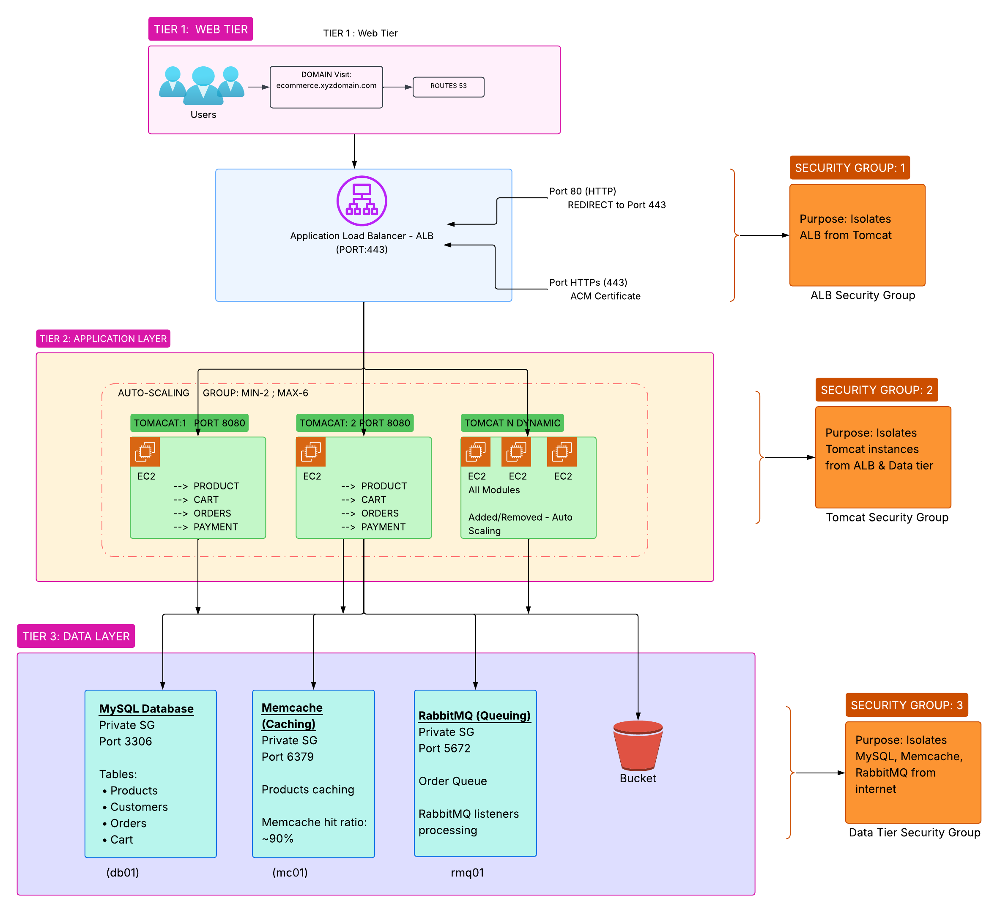
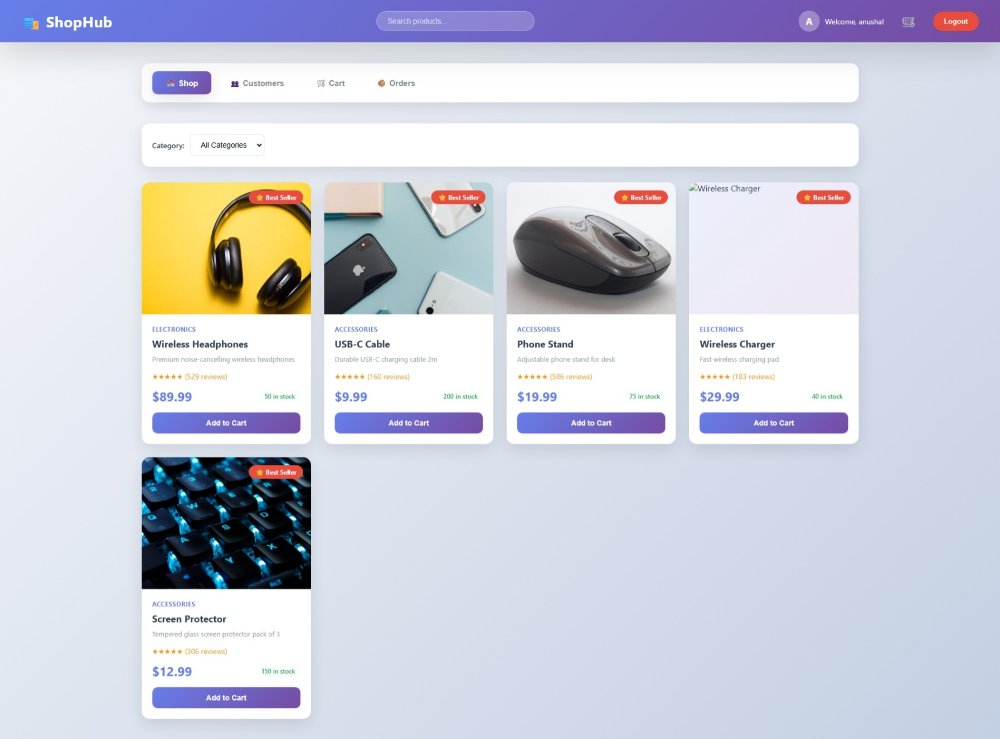

# AWS 3-Tier E-Commerce Web Application Deployment

A production-style 3-tier e-commerce application (**ShopHub**) deployed on AWS, with a focus on infrastructure: load balancing, target groups, auto scaling, and a multi-tier EC2 architecture.

## Architecture Overview

The application is split across isolated tiers, each on its own EC2 instance, with traffic distributed by an Application Load Balancer and elasticity provided by an Auto Scaling Group.

## Tech Stack

**Infrastructure (AWS)**
- EC2 — multi-tier compute (app, database, cache, messaging)
- Application Load Balancer — traffic distribution
- Target Groups — health checks and routing to instances
- Auto Scaling Group — elastic scaling of the app tier
- S3 — build artifact storage and delivery
- Security Groups — tier-to-tier network isolation
- VPC — private networking between tiers

**Application**
- Spring Boot 3.2 (Java 17)
- MySQL (data tier)
- Memcached (caching tier)
- RabbitMQ (messaging tier)

## Deployment Flow

1. Build the application artifact locally:
```bash
   mvn clean package -DskipTests
```
2. Upload the JAR to S3:
```bash
   aws s3 cp target/ecommerce-app-1.0.0.jar s3://ecommerce-proj-artifacts/
```
3. App instances pull the artifact from S3 and run it:
```bash
   aws s3 cp s3://ecommerce-proj-artifacts/ecommerce-app-1.0.0.jar .
   java -jar ecommerce-app-1.0.0.jar
```
4. The Application Load Balancer routes incoming traffic to healthy instances in the target group.

## Security Group Design

| Tier        | Port  | Source                        |
|-------------|-------|-------------------------------|
| ALB         | 80    | Internet (0.0.0.0/0)          |
| App (Tomcat)| 8080  | ALB security group            |
| MySQL       | 3306  | App security group            |
| Memcached   | 11211 | App security group            |
| RabbitMQ    | 5672  | App security group            |

Each tier only accepts traffic from the tier directly above it, enforcing network isolation.


## Key Engineering Decisions

- **Artifact delivery via S3** rather than building on each instance : keeps app servers stateless and makes scaling simpler.
- **Tier isolation via security groups** : database, cache, and messaging tiers are not internet-reachable; only the app tier can reach them.
- **Embedded Tomcat (standalone JAR)** rather than deploying a WAR into system Tomcat : simpler deployment and a single self-contained artifact.

## Infrastructure (AWS Console)

**Application Load Balancer — active with HTTPS listener**


**Target Group — registered instances passing health checks**


**Auto Scaling Group**


**ACM Certificate — issued for seekndiscover.cajkpro.xyz**


**EC2 Instances — four-tier layout**


## HTTPS / TLS

The application is served over HTTPS at **https://seekndiscover.cajkpro.xyz**, with TLS terminated at the load balancer using a certificate from **AWS Certificate Manager (ACM)**.

- A public certificate was provisioned in **ACM** for `seekndiscover.cajkpro.xyz`.
- The certificate was validated via **DNS**, with the ACM CNAME validation record added in the domain's **GoDaddy DNS management**.
- A **CNAME record in GoDaddy** points the domain to the Application Load Balancer's DNS name.
- The certificate is attached to an **HTTPS listener on port 443** on the ALB.
- The ALB **terminates TLS** and forwards requests to the app tier over HTTP (port 8080) inside the private network.
- The **port 80 listener redirects to HTTPS (443)**, ensuring all client traffic is encrypted.


## Live Application

The deployed ShopHub storefront, served from the app tier through the load balancer:




🔗 **Live:** https://seekndiscover.cajkpro.xyz

## Notes

This is a learning/portfolio project focused on AWS infrastructure and DevOps practices. Configuration values shown are examples; production deployments should use secrets management (e.g. AWS Secrets Manager / Parameter Store) rather than values in config files.
